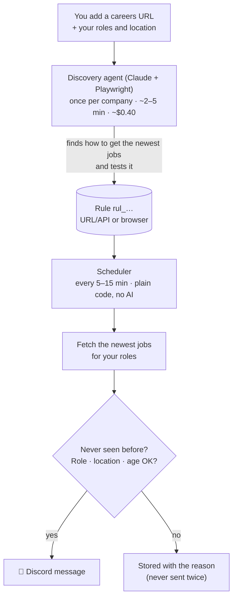
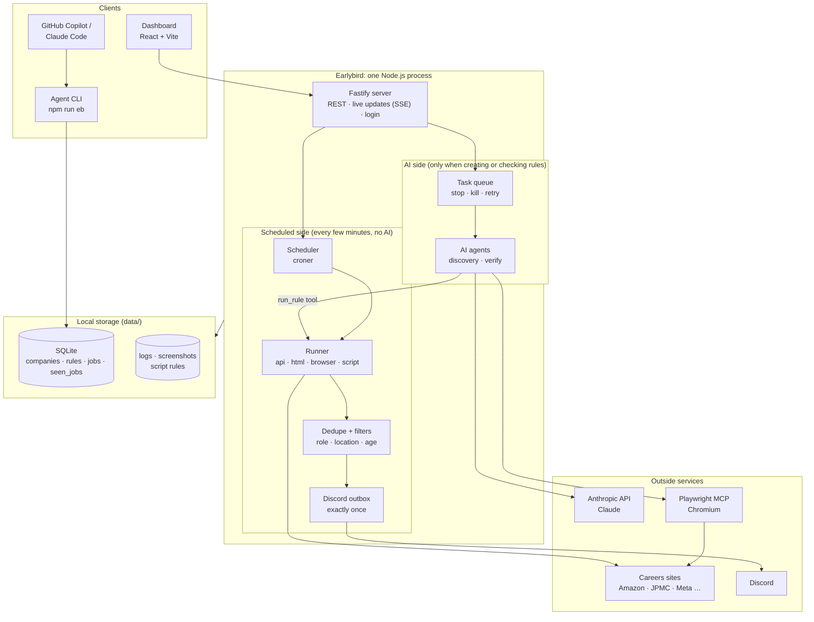
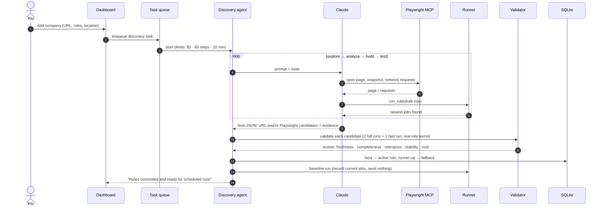
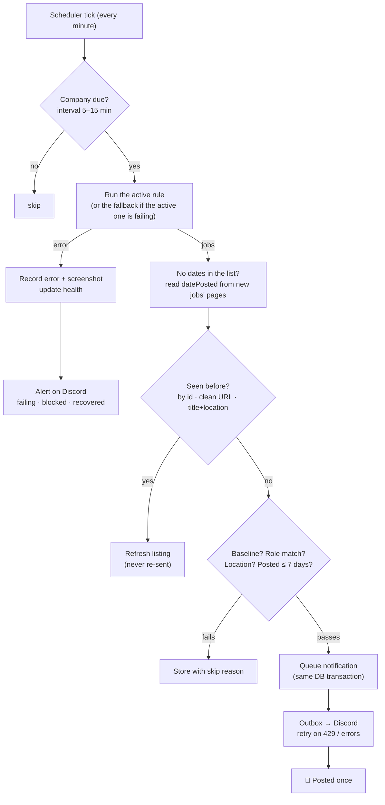
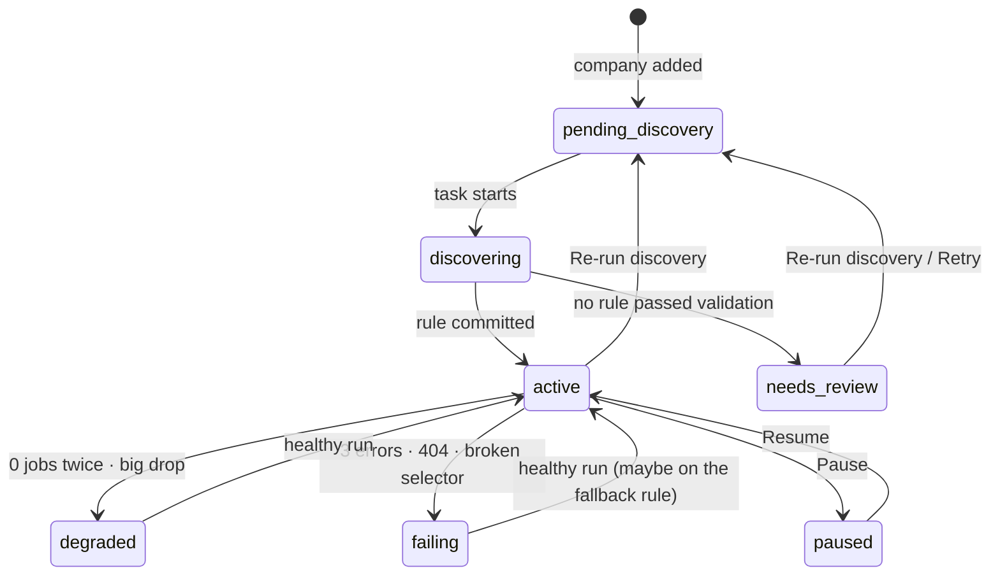
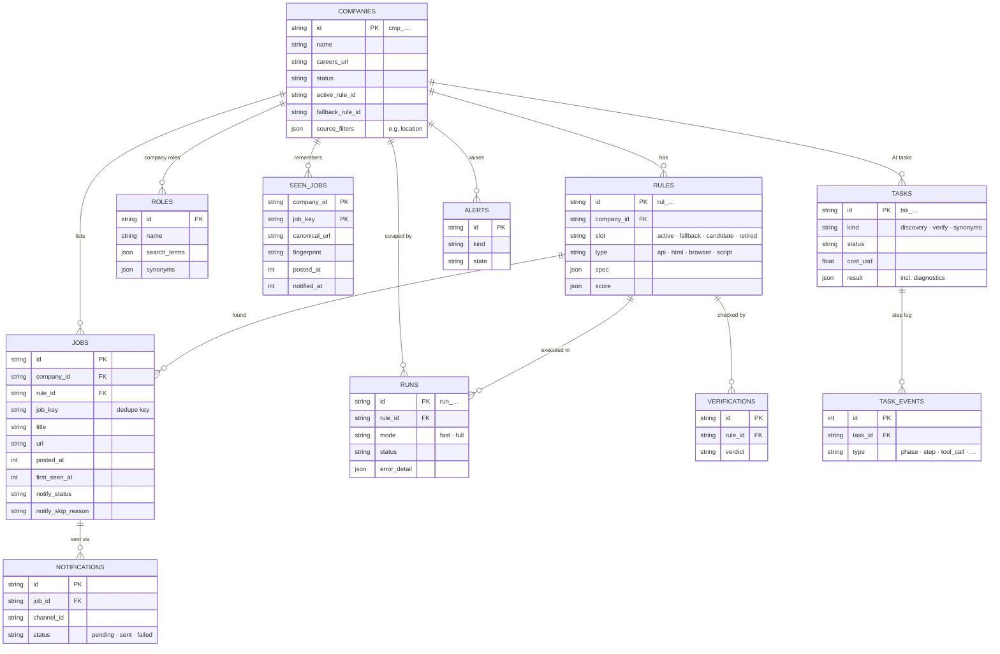

# 🐦 Earlybird

**Get new job postings in Discord minutes after they go live.**

Earlybird watches company careers pages (Amazon, JPMorgan Chase, Meta, any site) and posts **new** openings that match your roles to a Discord channel. An AI agent figures out *how* to read each careers site once; after that, plain code checks every few minutes, with no AI cost per check.

- **Add a company by pasting its careers URL.** An AI agent (Claude + a real browser) works out how to get that site's newest jobs.
- **Checks every few minutes** on a schedule, with no AI involved.
- **Only new jobs are sent.** Every job is remembered, so nothing is posted twice.
- **Filters by role, location and age** (e.g. "Software Engineer, QA Engineer", "United States", "posted in the last 7 days").
- **Everything is managed from a web dashboard:** companies, roles, settings, logs, and a step-by-step view of what the AI did.
- **Runs on your own laptop** (Windows, macOS, Linux). One setup command.

---

## Contents

- [How it works](#how-it-works)
- [Quick start](#quick-start)
- [Using Earlybird](#using-earlybird)
- [Configuration](#configuration)
- [Access from other devices (login)](#access-from-other-devices-login)
- [Commands](#commands)
- [Using it from GitHub Copilot / Claude Code](#using-it-from-github-copilot--claude-code)
- [Testing](#testing)
- [Architecture](#architecture)
- [Project structure](#project-structure)
- [Troubleshooting](#troubleshooting)
- [Tech stack](#tech-stack)

---

## How it works



**Rules.** Each company gets a *rule*: a small JSON recipe for reading its jobs.

| Rule type | Used when | Example |
|---|---|---|
| **URL / API** | The site has a JSON API or search URL | Amazon (`search.json?sort=recent`), JPMorgan Chase (Oracle Cloud API) |
| **Playwright (browser)** | Jobs are only visible in the rendered page | Meta (`jobsearch/?q=…&sort_by_new=true`) |
| **Script** | Rare: needs a token handshake JSON can't express | AI-written code, run in a locked-down sandbox |

The AI tries both URL and browser approaches, and code scores them on freshness, completeness, relevance, stability and cost. The best one goes live and the other is kept as a backup. Every rule has an id (`rul_…`), so any job, run or error can be traced back to the rule that produced it.

**"New" means first seen.** A job is sent the first time Earlybird ever sees it. The first run for a company is a silent *baseline* that records what's already there without sending anything. After that, only genuinely new postings are sent, and the same job is never sent twice (even if its link changes or the rule is replaced).

---

## Quick start

**You need:** [git](https://git-scm.com/) and [Node.js 22+](https://nodejs.org/). The setup script offers to install Node if it's missing.

```bash
git clone https://github.com/HrithikMani/Earlybird.git
cd Earlybird

./setup.sh        # macOS / Linux
.\setup.ps1       # Windows (PowerShell), or double-click setup.cmd
```

Setup installs dependencies and the Chromium browser, creates the local database, and can ask for your Anthropic API key, Discord webhook and first roles. You can skip the questions and set everything later in the dashboard. It's safe to run again.

Then start the app:

```bash
npm run dev       # development (auto-reload)
# or
npm run build && npm start    # production
```

Open **http://localhost:3000**.

### First steps in the dashboard

1. **Settings → AI:** paste your Anthropic API key (`sk-ant-…`). Needed only for discovery.
2. **Settings → Discord:** add a channel with your [Discord webhook URL](https://support.discord.com/hc/en-us/articles/228383668) and click **Send test**.
3. **Roles:** add the roles you want, e.g. `Software Engineer`, `QA Engineer`, `DevOps Engineer`.
4. **Companies → Add company:** name + careers URL (e.g. `https://www.amazon.jobs/en/search?base_query=Software+Development`), and optionally a location such as `United States`.
5. Watch the discovery task live under **Tasks**. When it says *"Rules committed and ready for scheduled runs"*, the company is active and new jobs will start arriving in Discord.

---

## Using Earlybird

### Dashboard pages

| Page | What you do there |
|---|---|
| **Overview** | Health (scheduler, database), counts, companies needing attention |
| **Companies** | Add companies; see status, active rule, last run. Per company: run now, re-run discovery, verify, pause, edit the rule, roles, location and age filters |
| **Roles** | Global roles with search terms, synonyms (e.g. SDE, SWE) and exclude words |
| **Jobs** | All jobs, sortable by posted date, filterable by company, status and *why it wasn't sent* |
| **Tasks** | AI discovery/verification tasks live: Stop, Kill, Retry with a note, and a **step-by-step AI log** with cost per phase and flagged wasteful steps |
| **Logs** | Everything that happened, searchable, with live tail |
| **Settings** | AI model + limits, Discord, scheduling, filters, retention, MCP tools, scripts |

### Filters: what gets sent

A job is sent to Discord only if **all** of these hold (otherwise it's stored with the reason, which you can see on the Jobs page):

| Check | Where to change it |
|---|---|
| Never seen before | automatic |
| Title matches one of your roles (name, search terms or synonyms; word order doesn't matter) | Roles page, or a company's Roles tab |
| In a wanted location (`United States` also matches `USA`, `US`, `Seattle, WA`, `Austin, TX`, …) | Company page → Location, or Settings → Filters |
| Posted within the last **7 days** (when the site shows a date) | Settings → Filters → `maxJobAgeDays`, or per company |
| Not excluded by keyword (e.g. `intern`) | Settings → Filters |

If a site's list doesn't show dates (e.g. Meta), Earlybird reads the hidden `datePosted` from each **new** job's detail page, once per job.

### Health and alerts

Earlybird watches its own rules. It notices errors, sites that block it, sudden drops to zero jobs, and broken page layouts, then posts alerts to a Discord alerts channel. When the main rule fails it switches to the backup rule automatically, and it tells you when things recover. The AI never rewrites a rule by itself: you choose to re-run discovery.

### Costs and limits

Discovery uses Claude through your API key, typically **$0.40–$0.60 and 2–5 minutes per company**, once. Each AI task is capped (defaults: **$2**, 60 steps, 10 minutes). It is also stopped if it loops, meaning it repeats the same call and gets the same result. Scheduled checks use no AI.

---

## Configuration

Almost everything is set in the dashboard (**Settings**) and stored in the local database. `.env` is optional and only bootstraps a few things. Copy `.env.example` to `.env`:

| Variable | Default | Purpose |
|---|---|---|
| `PORT` | `3000` | Web server port |
| `HOST` | `127.0.0.1` | `0.0.0.0` makes it reachable from other devices on your network |
| `EARLYBIRD_USERNAME` | `admin` | Dashboard login username |
| `EARLYBIRD_PASSWORD` | *(none)* | Turns the login page on. Without it, anyone who can reach the server can use it |
| `EARLYBIRD_AUTH_LOCAL` | *(off)* | `1` = require the login on this computer too |
| `ANTHROPIC_API_KEY` | *(none)* | Used only if no key is saved in Settings → AI |
| `DATA_DIR` | `./data` | Where the database, logs and screenshots live |
| `LOG_LEVEL` | `info` | Console log level |

`.env` and `data/` are gitignored: your API key, password and database never leave your machine.

---

## Access from other devices (login)

1. In `.env`:
   ```ini
   HOST=0.0.0.0
   EARLYBIRD_USERNAME=admin
   EARLYBIRD_PASSWORD=choose-a-strong-password
   ```
2. Restart. The log prints the address, e.g. `http://192.168.1.20:3000`.
3. Other devices see a **login page**. The session lasts 7 days, and there's **Log out** in the sidebar.

How the login is protected:
- The password is hashed (scrypt) and never stored in plain text.
- The session cookie is signed and HttpOnly.
- After 5 wrong attempts, that address is blocked for a minute.
- Every sign-in, failure and sign-out is logged.
- Changing the password signs everyone out.
- This computer skips the login so the CLI keeps working, unless `EARLYBIRD_AUTH_LOCAL=1`.

**Windows firewall:** other devices can only connect if the firewall allows it. On a trusted network, set it to *Private*, or open just this port in an **Administrator** PowerShell:

```powershell
New-NetFirewallRule -DisplayName "Earlybird 3000" -Direction Inbound -Protocol TCP -LocalPort 3000 -Action Allow
```

Only open it on networks you trust.

---

## Commands

| Command | What it does |
|---|---|
| `./setup.sh` · `.\setup.ps1` · `npm run setup` | First-time setup (safe to re-run; `-- --yes` skips questions) |
| `npm run doctor` | Checks Node, Chromium, database, API key, Discord and server, and says how to fix problems |
| `npm run dev` | Start with auto-reload (dashboard hot-reloads too) |
| `npm run build` / `npm start` | Build the dashboard / run in production mode |
| `npm test` | Unit tests (vitest) |
| `npm run test:e2e` | End-to-end tests (Playwright) against a mock careers site, mock Discord and mock AI: free, offline |
| `npm run test:all` | Both of the above |
| `npm run test:replay` | **Proof on real sites:** runs each company's rule live, then replays a recording with a fake new job injected and checks it reaches Discord |
| `npm run eb -- <command>` | Agent CLI (see below). `npm run eb -- --help` lists commands |
| `npm run rule -- <ruleId> [--full]` | Dry-run a rule and print the jobs it finds |
| `npm run verify -- <ruleId> --window 1h` | Ask the AI to check a rule is catching the newest jobs |
| `npm run db:generate` | Create a database migration after changing `src/db/schema.js` |

---

## Using it from GitHub Copilot / Claude Code

The `prompts/` folder holds **playbooks** (discover, verify, repair a rule) that work both for Earlybird's own agent and for your IDE agent. IDE agents use the **Agent CLI** instead of touching the database, so every rule they import goes through the same validation and can't break the running app.

```bash
npm run eb -- mcp check                                   # is the Playwright browser available?
npm run eb -- company show <companyId> --json             # careers URL, roles, search terms
npm run eb -- rule test --file data/drafts/x.json --company <id> --json
npm run eb -- rule import --file data/drafts/x.json --company <id> --activate --json
npm run eb -- verify precheck <ruleId> --window 1h --json
```

In VS Code: open `.vscode/mcp.json` → **Start** the `playwright` server → Copilot Chat in **Agent** mode → run `/discover-rule`, `/verify-rule` or `/repair-rule`. See [`prompts/README.md`](prompts/README.md).

---

## Testing

- **Unit tests** (`test/`): location matching, login and sessions.
- **End-to-end tests** (`e2e/specs/`): drive the real app in a browser against a **mock careers portal** (API, HTML, JavaScript single-page app, token-protected site), **mock Discord** and a **scripted mock AI**, so they cost nothing and run offline. They cover:
  - notifications, dedupe and quick/full checks
  - stale jobs, failures and backup rules
  - discovery, task Stop/Kill/Retry and the AI safety limits
  - verification, the CLI, job sorting and filtering
  - the job cap, date lookup from detail pages, and the login
- **Replay test** (`npm run test:replay`): runs each company's real rule against the live site, records the responses (or rendered pages for browser rules), injects a fake new job, and checks it arrives in Discord and that nothing else is sent.

```bash
npm run test:all       # unit + e2e
npm run test:report    # open the last Playwright report (traces, screenshots, videos)
```

---

## Architecture

Earlybird is a single Node.js process: a Fastify server, the scheduler, the background task queue and the AI agents all run together, backed by one SQLite file.

### System overview



- **Runner** is pure: given a rule, it returns jobs. It never touches the database or calls AI, so discovery, validation, the scheduler and the CLI all run rules the same way.
- **AI is used only in `src/agents/`**, and only to *create* or *check* rules. Scheduled checks never call Claude.
- **The CLI** reads and writes the database directly (safe while the app runs), and talks to the server only for task commands.

### Discovery: from a URL to a live rule



Every step is recorded: the task page shows a step-by-step log with the cost of each phase, and flags avoidable steps (failed clicks, retries, off-task actions) so the prompt can be improved.

### A scheduled run



### Company lifecycle



### Data model



`seen_jobs` is the permanent memory behind "only new jobs are sent": it keeps every job ever seen (even ones that were filtered out or deleted), so the same posting can never trigger a second message.

---

## Project structure

```
Earlybird/
├── src/
│   ├── runner/      # runs a rule → jobs (API, HTML, browser, sandboxed script). No DB, no AI.
│   ├── worker/      # scheduler (cron), scrape runs, dedupe, health/alerts, cleanup
│   ├── agents/      # the only place AI is used: discovery, verification, step review
│   ├── tasks/       # background task queue, live events, stop/kill/retry
│   ├── roles/       # role and location matching
│   ├── notify/      # Discord (exactly-once outbox)
│   ├── server/      # Fastify API, login, live updates (SSE)
│   ├── db/          # SQLite schema + migrations (Drizzle)
│   ├── schema/      # zod schemas: rules, jobs, settings, AI outputs
│   └── cli/         # the `npm run eb` Agent CLI
├── web/             # React dashboard (Vite)
├── prompts/         # AI playbooks (discovery, verification, repair, synonyms)
├── e2e/             # Playwright tests, mock portal, mock Discord, scripted AI conversations
├── test/            # unit tests (vitest)
├── scripts/         # setup, doctor, preflight, replay test
├── .github/         # Copilot instructions + prompt files
└── CLAUDE.md        # full design document (architecture, data model, conventions)
```

Local data lives in `data/` (gitignored): the SQLite database, rotating logs, failure screenshots and saved AI script rules. The full design is in [`CLAUDE.md`](CLAUDE.md).

---

## Troubleshooting

| Problem | Fix |
|---|---|
| Something's not working | `npm run doctor` explains what's missing |
| `better-sqlite3` fails to load | `npm rebuild better-sqlite3`. Earlybird pins v12, which ships prebuilt binaries, so no compiler is normally needed |
| Other devices can't open the dashboard | Set `HOST=0.0.0.0`, restart, and allow port 3000 in the firewall (see [above](#access-from-other-devices-login)) |
| Discovery stopped with `cost_limit` / `max_steps` / `loop_detected` | Open the task, check the **step-by-step AI log**, then **Retry** with a note (e.g. "use the JSON API") or raise the limits in Settings → AI |
| Jobs found but nothing in Discord | Check Settings → Discord (**Send test**). On the Jobs page, filter by *skip reason* to see why each job wasn't sent |
| A company is *failing* | Company → Runs shows the exact error, the response, and a screenshot for browser rules. Try **Re-run discovery** |
| Several runs failed at the same moment | Usually a dropped internet connection; the next runs recover automatically |

---

## Tech stack

Node 22 (JavaScript, ES modules) · Fastify · SQLite (better-sqlite3 + Drizzle) · zod · Vercel AI SDK + Claude · Playwright + Playwright MCP · croner · pino · React + Vite · vitest + @playwright/test
